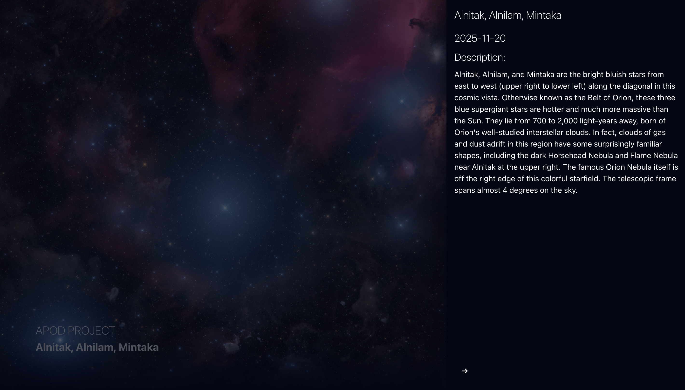

# NASA App - Astronomy Picture of the Day

This project is a React Application that fetches data from the NASA API.  
The main goal of this app is to demonstrate how to consume an external API and display its data in a modern web interface.

## 🖼️ Screenshots / Demo

### Home Screen


### Detail Screen



---

## 🎯 Project Objective

The purpose of this project is to:

- Fetch data and images from NASA's API
- Display information and media in a user-friendly interface
- Practice working with React, environment variables, and API requests
- Create a clean and organized codebase suitable for a portfolio

---

## 🔑 Getting a NASA API Key

To use this project, you need your own API key from NASA:

1. Go to the [NASA API portal](https://api.nasa.gov/).
2. Sign up with your email and request an API key.
3. You will receive a key via email.
4. Add your key to a `.env` file in the project root as follows:

```env
VITE_NASA_API_KEY=YOUR_NASA_API_KEY_HERE
```
